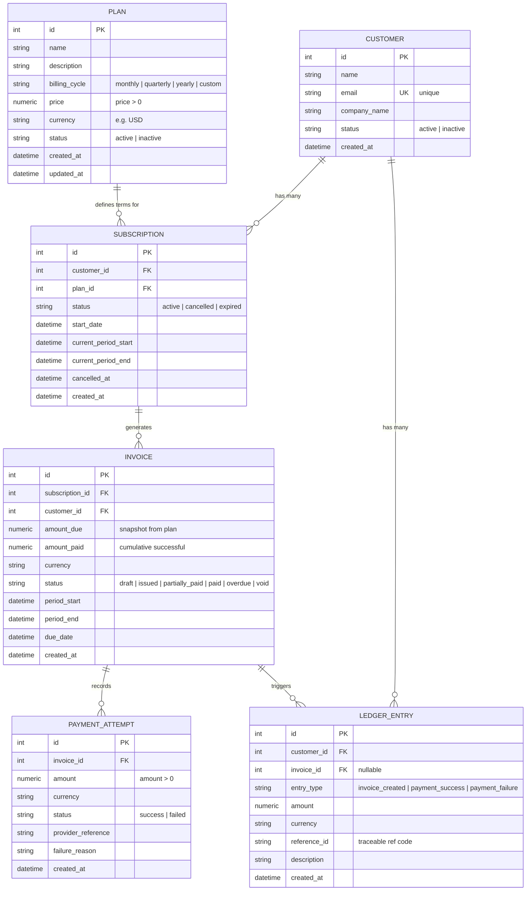
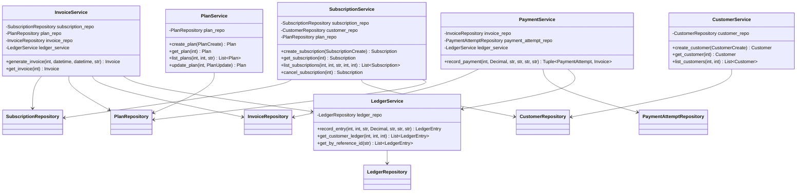
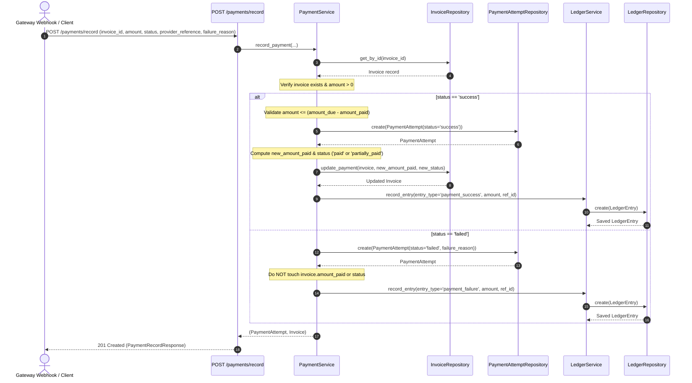

# SubLedger — Low-Level Design (LLD) Document

## 1. System Overview & Architectural Vision

SubLedger is a modular, high-reliability billing and financial ledger backend engineered for SaaS subscription management. The platform cleanly models the lifecycle of commercial recurring subscriptions:
- Cataloging subscription plans
- Managing customer profiles
- Orchestrating recurring subscription states
- Generating period-accurate invoices with price snapshotting
- Processing successful and failed payment attempts
- Maintaining an append-only, immutable financial ledger for complete auditability

### Core Architectural Principles
1. **Separation of Concerns (SoC) & SOLID Principles**:
   - **Routes / Controllers**: Exclusively manage HTTP serialization, parameter validation, and status code dispatch.
   - **Services Layer**: Encapsulates domain logic, workflow orchestration, and business invariant enforcement.
   - **Repository Layer**: Encapsulates all data access primitives, SQL queries, and ORM abstractions.
   - **Models**: Defines relational database entities, indices, and foreign key constraints.
   - **Schemas**: Validates inbound DTOs and serializes outbound API contracts with type safety.
2. **Immutability of the Financial Ledger**:
   - The ledger represents the single source of financial truth. It is strictly append-only; update and delete operations are prohibited at both repository and service layers.
3. **Inversion of Control & Dependency Injection**:
   - Concrete dependencies (Repositories, Services, DB Sessions) are injected at runtime using FastAPI's dependency injection container, decoupling business logic from infrastructure and enabling testability.

---

## 2. Entity Relationship Diagram (ERD)



---

## 3. Layered Architecture & Class Diagram



---

## 4. Service Responsibility Table

| Service | What Logic It Owns | What It Should NOT Do |
| :--- | :--- | :--- |
| **`PlanService`** | Validates plan price (`price > 0`), verifies billing cycle formatting, handles plan updates and deactivation flags. | Does not execute direct SQL/ORM queries. Does not manage subscription lifecycles. |
| **`CustomerService`** | Enforces customer email uniqueness prior to persistence, orchestrates profile lookups, validates customer existence. | Does not directly mutate subscription statuses. Does not format HTTP response envelopes. |
| **`SubscriptionService`** | Verifies plan is active before allowing subscription, verifies customer has no existing active subscription to the same plan, computes period boundaries (`current_period_start`, `current_period_end`), manages cancellation state transitions. | Does not generate invoices directly. Does not charge payment methods or access payment gateways. |
| **`InvoiceService`** | Verifies subscription is active, snapshots plan price into `amount_due`, computes period and due dates, creates invoice, delegates `invoice_created` event to `LedgerService`. | Does not process payments or update payment attempts directly. Does not perform raw SQL inserts. |
| **`PaymentService`** | Validates payment attempt amounts (`amount > 0`), enforces business rule that successful payments cannot exceed remaining unpaid balance (`amount_due - amount_paid`), determines resulting invoice state (`partially_paid` vs `paid`), ensures failed payments do not increment `amount_paid`, triggers `LedgerService` events (`payment_success` / `payment_failure`). | Does not generate new invoices. Does not communicate with third-party payment gateway SDKs directly. |
| **`LedgerService`** | Validates ledger event types (`invoice_created`, `payment_success`, `payment_failure`), creates immutable ledger records, retrieves customer financial audit logs by reference ID or customer ID. | Never modifies or deletes ledger records (strictly append-only). Does not alter invoice or subscription states. |

---

## 5. Repository Responsibility Table

| Repository | Entities It Reads / Writes | Common Methods | Invariants & Constraints |
| :--- | :--- | :--- | :--- |
| **`PlanRepository`** | `Plan` | `create()`, `get_by_id()`, `list_all()`, `update()` | Price and billing cycle persistence. |
| **`CustomerRepository`** | `Customer` | `create()`, `get_by_id()`, `get_by_email()`, `list_all()` | Email unique index enforcement. |
| **`SubscriptionRepository`** | `Subscription` | `create()`, `get_by_id()`, `get_active_by_customer_and_plan()`, `list_all()`, `update()` | Queried to guarantee at most one active subscription per (customer, plan) pair. |
| **`InvoiceRepository`** | `Invoice` | `create()`, `get_by_id()`, `list_by_subscription_id()`, `update_payment()` | Manages `amount_paid` updates and invoice status transitions. |
| **`PaymentAttemptRepository`** | `PaymentAttempt` | `create()`, `get_by_id()`, `list_by_invoice_id()` | Logs all incoming payment transactions and gateway responses. |
| **`LedgerRepository`** | `LedgerEntry` | `create()`, `get_by_id()`, `list_by_customer_id()`, `list_by_reference_id()` | **Strictly Append-Only**: Explicitly omits `update()` and `delete()` methods. |

---

## 6. Business Rule Ownership Matrix

| Business Rule | Architectural Layer | Component | Implementation Mechanism |
| :--- | :--- | :--- | :--- |
| **1. Plan price must be greater than 0** | Schema & Service | `PlanCreate` / `PlanUpdate` & `PlanService` | Pydantic `Field(gt=0)` + `PlanService` verification raising `BusinessRuleViolationException`. |
| **2. Customer email must be unique** | Service, Repository & DB | `CustomerService` & `Customer.email` | DB unique constraint on `email` + `CustomerRepository.get_by_email()` checked in `CustomerService`, raising `ConflictException`. |
| **3. Inactive plan cannot be subscribed to** | Service Layer | `SubscriptionService` | Inspects `plan.status == 'active'` before creation; raises `BusinessRuleViolationException`. |
| **4. No duplicate active subscription to same plan** | Service & Repository | `SubscriptionService` & `SubscriptionRepository` | `SubscriptionRepository.get_active_by_customer_and_plan()` query; raises `ConflictException` if active record exists. |
| **5. Invoice amount_due snapshots plan price** | Service Layer | `InvoiceService` | Evaluates `plan.price` at the instant of invoice generation and freezes value into `invoice.amount_due`. |
| **6. Successful payment cannot exceed unpaid balance** | Service Layer | `PaymentService` | Validates `amount <= (invoice.amount_due - invoice.amount_paid)`; raises `BusinessRuleViolationException` if exceeded. |
| **7. Invoice status progression on payment** | Service & Repository | `PaymentService` & `InvoiceRepository` | If `new_amount_paid >= amount_due` -> `paid`; else `partially_paid`. Committed atomically. |
| **8. Failed payment does not increase amount_paid** | Service Layer | `PaymentService` | Stores `PaymentAttempt` with `failure_reason`; bypasses updating `invoice.amount_paid`. |
| **9. Ledger entries are append-only & traceable** | Service & Repository | `LedgerService` & `LedgerRepository` | Repository only implements `create` and `read`; each entry stores `reference_id` linking to `INV-{id}` or `PAY-{id}` / provider ref. |

---

## 7. Core Workflows

### 7.1. Invoice Generation Flow

```mermaid
sequenceDiagram
    autonumber
    actor Client as API Consumer / Cron
    participant Route as POST /invoices/generate
    participant InvSvc as InvoiceService
    participant SubRepo as SubscriptionRepository
    participant PlanRepo as PlanRepository
    participant InvRepo as InvoiceRepository
    participant LedgSvc as LedgerService
    participant LedgRepo as LedgerRepository

    Client->>Route: POST /invoices/generate (subscription_id, custom periods)
    Route->>InvSvc: generate_invoice(subscription_id, period_start, period_end, status)
    InvSvc->>SubRepo: get_by_id(subscription_id)
    SubRepo-->>InvSvc: Subscription record
    Note over InvSvc: Verify subscription exists & status == 'active'
    InvSvc->>PlanRepo: get_by_id(subscription.plan_id)
    PlanRepo-->>InvSvc: Plan record
    Note over InvSvc: Snapshot plan.price as amount_due; calculate billing period & due_date
    InvSvc->>InvRepo: create(Invoice(amount_due, status='issued', ...))
    InvRepo-->>InvSvc: Saved Invoice
    InvSvc->>LedgSvc: record_entry(customer_id, invoice_id, 'invoice_created', amount_due, ref_id)
    LedgSvc->>LedgRepo: create(LedgerEntry)
    LedgRepo-->>LedgSvc: Saved LedgerEntry
    InvSvc-->>Route: Invoice entity
    Route-->>Client: 201 Created (InvoiceResponse)
```

#### Step-by-Step Rationale:
1. The route parses `subscription_id` and optional billing period overrides.
2. `InvoiceService` queries `SubscriptionRepository` for the subscription.
3. If subscription is missing or inactive, raises domain exception (`EntityNotFoundException` / `BusinessRuleViolationException`).
4. `InvoiceService` fetches the associated `Plan` to obtain the current price.
5. `amount_due` is snapshotted from `plan.price`. Start and end timestamps are established from subscription cycle or payload.
6. `InvoiceRepository` persists the invoice with initial status `issued`.
7. `LedgerService` creates an immutable `invoice_created` ledger entry referencing `INV-{invoice_id}`.
8. The HTTP response returns the structured `InvoiceResponse` DTO.

---

### 7.2. Payment Recording Flow



#### Step-by-Step Rationale:
1. Route accepts payment details (`invoice_id`, `amount`, `status`, `provider_reference`, optional `failure_reason`).
2. `PaymentService` fetches the invoice via `InvoiceRepository`.
3. If invoice does not exist, raises `EntityNotFoundException`.
4. If payment `status == "success"`:
   - Validates that invoice is not already fully paid and that payment amount does not exceed `amount_due - amount_paid`.
   - Records `PaymentAttempt` with `status="success"`.
   - Increments `invoice.amount_paid` and updates status to `paid` if fully satisfied, or `partially_paid`.
   - Calls `LedgerService` to record a `payment_success` ledger entry.
5. If payment `status == "failed"`:
   - Records `PaymentAttempt` with `status="failed"` and stores `failure_reason`.
   - Leaves `invoice.amount_paid` and status unaltered.
   - Calls `LedgerService` to record a `payment_failure` ledger entry.
6. Returns both the payment attempt details and the refreshed invoice status to the caller.

---

## 8. Design Patterns Rationale

### 1. Repository Pattern
- **Motivation**: Direct ORM queries (`session.query(...)`) scattered across route handlers make applications difficult to test, maintain, or migrate.
- **Implementation**: Every aggregate root entity has a dedicated repository (`PlanRepository`, `CustomerRepository`, `SubscriptionRepository`, `InvoiceRepository`, `PaymentAttemptRepository`, `LedgerRepository`) extending `BaseRepository`.
- **Benefit**:
  - Encapsulates database queries in one testable location.
  - Allows swapping database backends (e.g. SQLite for in-memory unit tests vs PostgreSQL for production) without touching business logic.
  - Enforces architectural constraints (e.g., `LedgerRepository` intentionally lacks update and delete methods).

### 2. Service Layer Pattern
- **Motivation**: Route handlers should remain lean and only concern themselves with HTTP-level concerns. Business rules spanning multiple entities (e.g. creating an invoice requires querying a subscription, a plan, saving the invoice, and writing to the ledger) belong in a dedicated service layer.
- **Implementation**: Services (`InvoiceService`, `PaymentService`, etc.) accept repositories and collaborator services as injected constructor arguments.
- **Benefit**:
  - High cohesion: Business logic is grouped by domain area.
  - Transactional consistency: Multi-step domain workflows are coordinated centrally.
  - Exception abstraction: Services raise domain-specific exceptions (`BusinessRuleViolationException`, `ConflictException`) rather than leaky database or HTTP exceptions.

### 3. Dependency Injection (IoC)
- **Motivation**: Avoid hardcoded singleton instantiations inside classes, which hinder unit testing and prevent mocking.
- **Implementation**: FastAPI's `Depends()` mechanism resolves the dependency graph (`Session` -> `Repository` -> `Service` -> `Router`) dynamically per request lifecycle.
- **Benefit**: In tests, `client` fixtures can override `get_db` with an isolated in-memory SQLite database without modifying application code.
